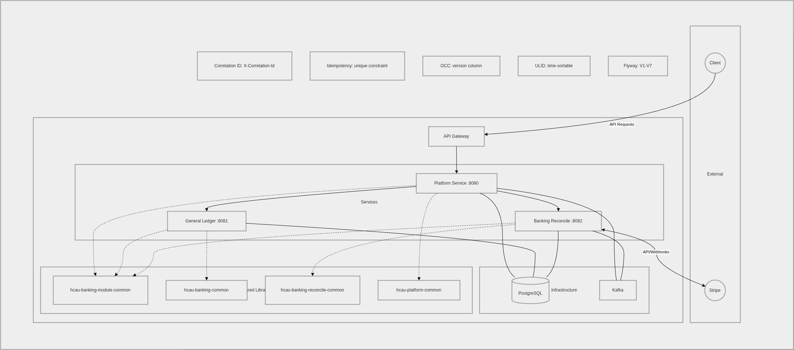

# haicau

Multi-module haicau workspace (Spring Boot + Maven).
.png
## Architecture



## Ledger design

The platform uses a typed Chart of Accounts (CoA) path format. Every account is identified by a
colon-delimited path such as `wallet:{customer_id}:{wallet_id}:main` or
`receivable:counterparty:stripe`.

**Provider trust model:** The platform trusts the payment provider (e.g. Stripe) to settle.
When a customer initiates a deposit, a receivable claim is recorded immediately against the
provider — the platform accepts the risk that the provider may fail to confirm. The customer
wallet follows `reserved → clearing → main` for internal auditability and clean reversal paths,
independent of the trust decision. The customer's balance is not spendable until the sweep job
moves funds from `clearing` to `main`.

See [plan-coa-redesign.md](plan-coa-redesign.md) for the full CoA design and deposit flow.

## Modules

- `hcau-general-ledger`
  General ledger system server.
- `hcau-banking-reconcile`
  Reconcile worker/service for the general ledger.
- `hcau-banking-common`
  Shared common module for the general ledger.
- `hcau-banking-reconcile-common`
  Shared reconcile scheduler/library module.
- `hcau-banking-module-common`
  Shared module resources/utilities.
- `hcau-platform-common`
  Shared platform module consumed by platform services.
- `hcau-platform-service`
  Platform-facing Spring Boot service.

## Tech stack

- Java 21
- Spring Boot 4.0.0
- Maven
- PostgreSQL
- Flyway (migration plugin in server modules)

## Build

From repository root, build/install modules with Maven in dependency order:

```bash
mvn -f hcau-banking-module-common/pom.xml clean install
mvn -f hcau-banking-common/pom.xml clean install
mvn -f hcau-banking-reconcile-common/pom.xml clean install
mvn -f hcau-platform-common/pom.xml clean install
mvn -f hcau-general-ledger/pom.xml clean install
mvn -f hcau-banking-reconcile/pom.xml clean install
mvn -f hcau-platform-service/pom.xml clean install
```

## Docker Compose

Run from repository root.

### Start infrastructure only

```bash
docker compose -f docker-compose.infra.yml up -d
```

### Start apps (with infrastructure)

```bash
docker compose -f docker-compose.infra.yml -f docker-compose.apps.yml --profile apps up -d
```

### Stop and remove containers

```bash
docker compose -f docker-compose.infra.yml -f docker-compose.apps.yml down
```

### Endpoints

- Kafka UI: http://localhost:8090
- General ledger: http://localhost:8081
- Banking reconcile: http://localhost:8082

## Scripts

Utility scripts live in the `scripts/` directory.

### `scripts/EncryptCredential.java` — Encrypt a provider credential

Encrypts Stripe credentials using AES-256-GCM — the same scheme as `CredentialEncryptionService`
in `hcau-platform-service`. Enter the raw Stripe key; the script builds the JSON and encrypts
the whole blob, so no key names are visible in the database.

**Prerequisites**

- Java 21 on PATH (already required to build the project).
- `CREDENTIALS_ENCRYPTION_KEY` — Base64-encoded 32-byte AES key. Generate once per environment:
  ```bash
  openssl rand -base64 32
  ```
  Store this value in `hcau-platform-service/.env`.

**Run**

```bash
CREDENTIALS_ENCRYPTION_KEY="<base64-key>" java --source 21 scripts/EncryptCredential.java
```

When prompted, enter the raw Stripe key (hidden input):

```
Enter Stripe secret key (sk_live_... or sk_test_...): [hidden]

SQL to update the providers table:
  UPDATE "platform-service".providers
  SET credentials = '<encrypted-blob>'
  WHERE code = 'stripe';
```

Copy that SQL and run it against the `central-banking` database.

**When to run**

Run this once after `hcau-platform-service` migrations have been applied (the `providers`
table must exist at schema version ≥ 2). `CREDENTIALS_ENCRYPTION_KEY` must remain set in
the service environment on every startup — it is used to decrypt the stored credential at
runtime.

## Database migrations

Each service module manages its own schema with Flyway. Migration files live in two locations:

| Location | Used by |
|---|---|
| `<module>/db/migration/` | Maven Flyway plugin (manual runs) |
| `<module>/src/main/resources/db/migration/` | Spring Boot Flyway (auto-run on startup) |

**Run migrations manually** (replace values as needed):

```bash
# hcau-platform-service
cd hcau-platform-service
export $(tr -d '\r' < .env | grep -v '^#' | xargs)
mvn flyway:migrate \
  -Dflyway.url="jdbc:postgresql://${DB_HOST}:${DB_PORT}/${DB_NAME}?currentSchema=${DB_SCHEMA}" \
  -Dflyway.user="${DB_USER}" \
  -Dflyway.password="${DB_PASSWORD}" \
  -Dflyway.schemas="${DB_SCHEMA}"
```

Run the same command from `hcau-general-ledger/` for the general-ledger schema.

> Both modules target the `central-banking` database (set `DB_NAME=central-banking` in `.env`).
> `hcau-platform-service` uses schema `platform-service`; `hcau-general-ledger` uses schema
> configured by `DB_SCHEMA` (default `general-ledger`).

## Notes

- Environment files are expected per module (`.env`, `.env.example`).
- Flyway helper command examples are documented inside module READMEs.
